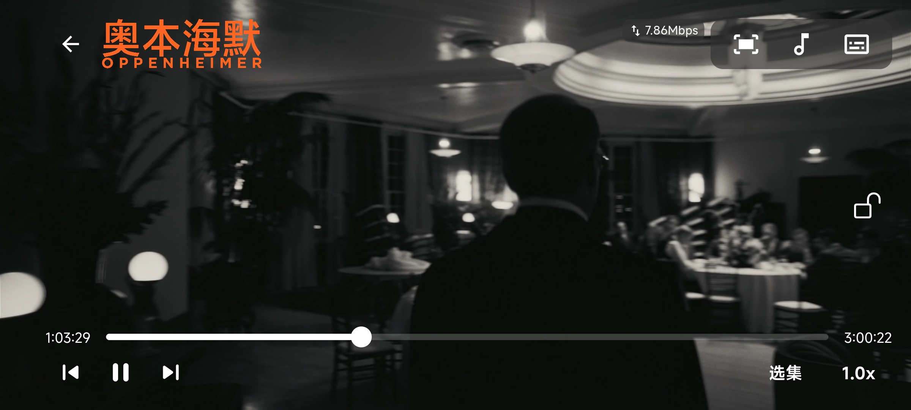
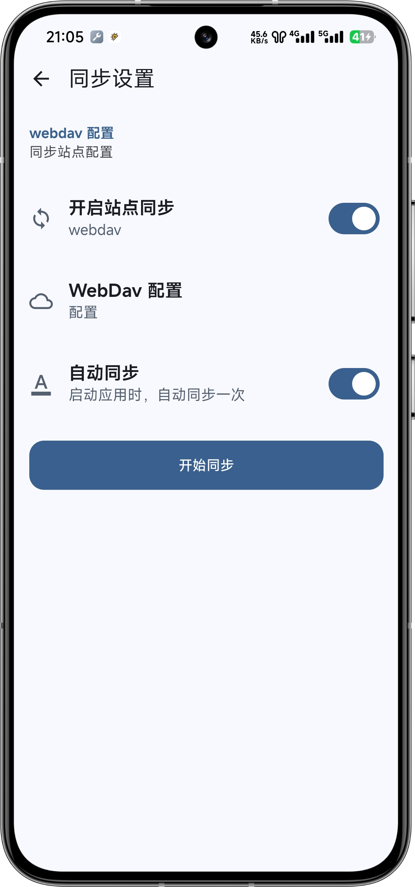
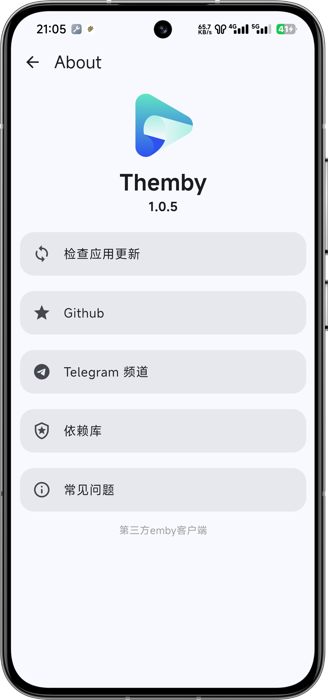
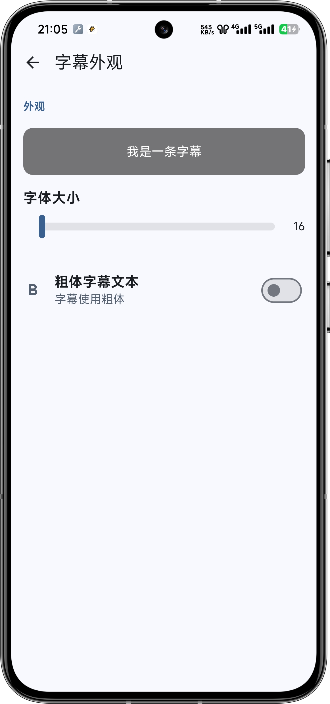
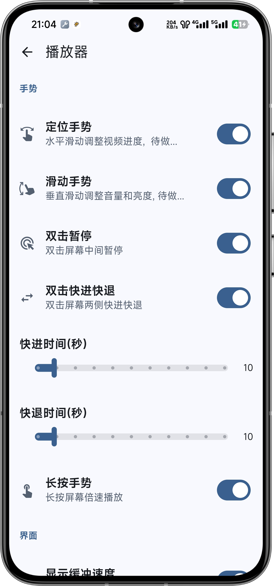
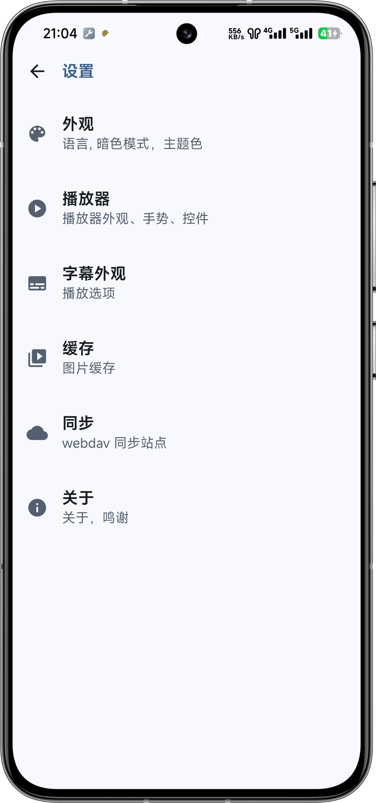
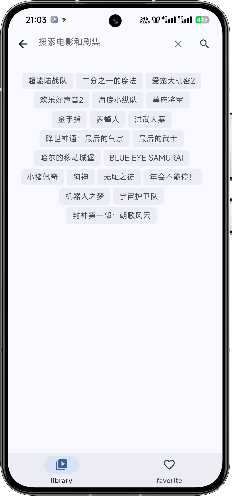
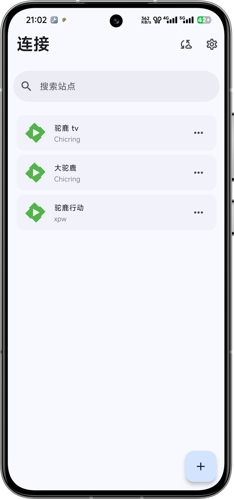

# **Themby**
第三方emby播放器

## 项目介绍
**目前还在完善中**

由flutter编写的emby客户端， 使用 GoRouter、Riverpod、Dio、Media_Kit、Objectbox等插件。

目前只支持安卓，使用mpv播放器，支持搜索，收藏，播放历史等功能。
## 使用说明

## 项目截图

<table>  
  <tr>  
    <td></td>  
    <td></td>  
    <td></td>  
    <td></td>  
  </tr>  
  <tr>  
    <td></td>  
    <td></td>  
    <td></td>  
    <td></td>  
  </tr>  
  <tr>  
    <td></td>  
    <td></td>  
    <td></td>  
    <td></td>  
  </tr>  
  <tr>  
    <td></td>  
    <td></td>  
    <td></td>  
  </tr>  
</table>  

## 感谢项目

- [pilipala](https://github.com/guozhigq/pilipala/)
- [dio](https://pub.dev/packages/dio)
- [media_kit](https://github.com/media-kit/media-kit)
- 等等